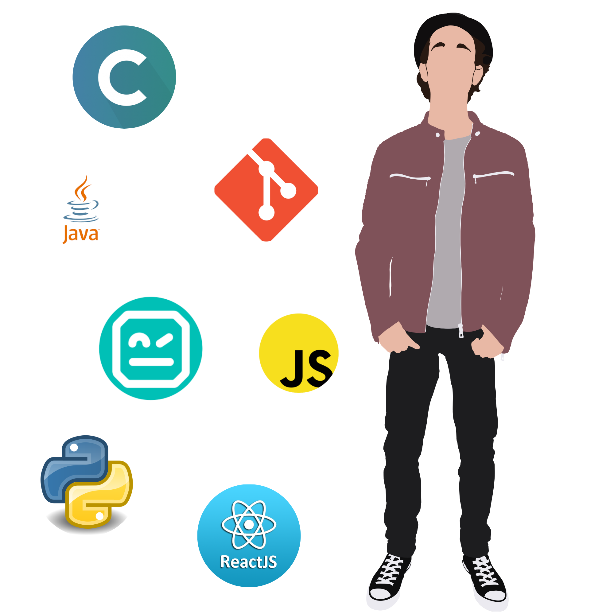

------------------------------------------------------------------------------------------

### Hi there, I'm ZagoPedro!

  <a href="https://github.com/ZagoPedro">
  
  

------------------------------------------------------------------------------------------
  

  
------------------------------------------------------------------------------------------

### PT-BR
  
• nome: Pedro H. Z. Costa

• idade: 21 anos

• ferramentas que tenho experiência: Visual Studio Code, Dev C++, Code Blocks IDE, Apache NetBeans IDE, Eclipse IDE for Java Developers, Sublime Text 3, PyCharm, Git, GitHub

• um pouco de Testes de Software: RobotFramework, Appium, Selenium, Android Studio

:small_blue_diamond: cursando Ciência da Computação na Faculdade de Ciências e Tecnologia - UNESP

:small_orange_diamond: ex-membro da empresa júnior EJComp (01/04/2020 - 12/04/2021)

:small_orange_diamond: trabalhando no laboratório de Testes de Software da prefeitura de Presidente Prudente

------------------------------------------------------------------------------------------

### EN-US

• name: Pedro H. Z. Costa

• age: 21 y.o.

• tools I have experience: Visual Studio Code, Dev C++, Code Blocks IDE, Apache NetBeans IDE, Eclipse IDE for Java Developers, Sublime Text 3, PyCharm, Git, GitHub

• a little of Software Testing: RobotFramework, Appium, Selenium, Android Studio

:small_blue_diamond: studying Computer Science in Faculdade de Ciências e Tecnologia - UNESP

:small_orange_diamond: former member of the company EJComp (04/01/2020 - 04/12/2021)

:small_orange_diamond: working in the Software Testing laboratory of the city hall of Presidente Prudente

------------------------------------------------------------------------------------------
  

  
  
  
 

